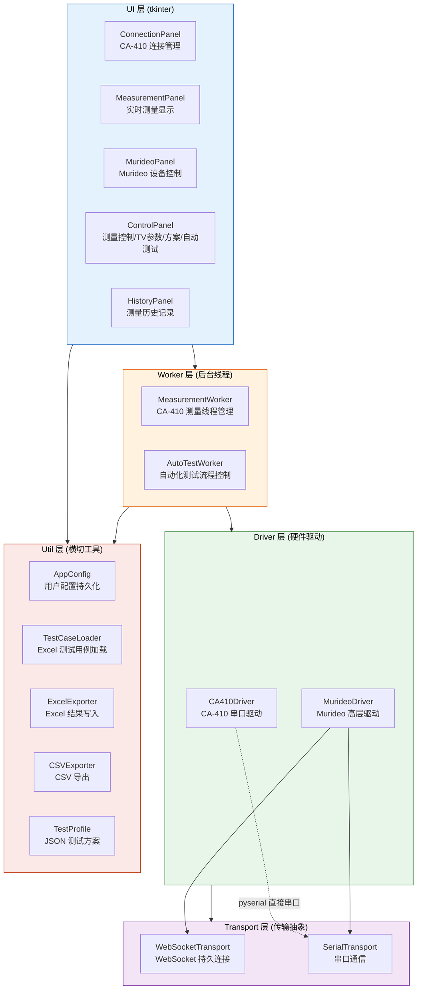
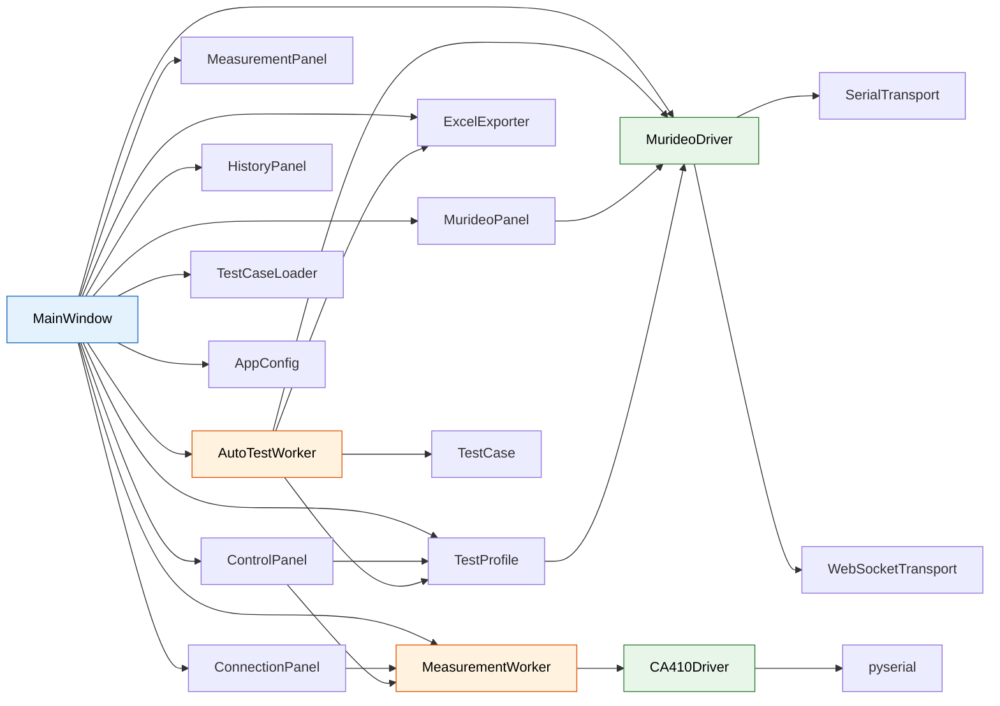
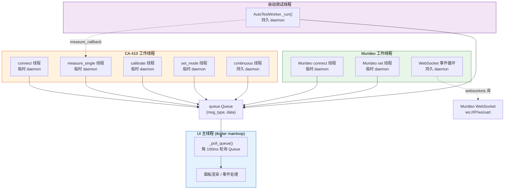
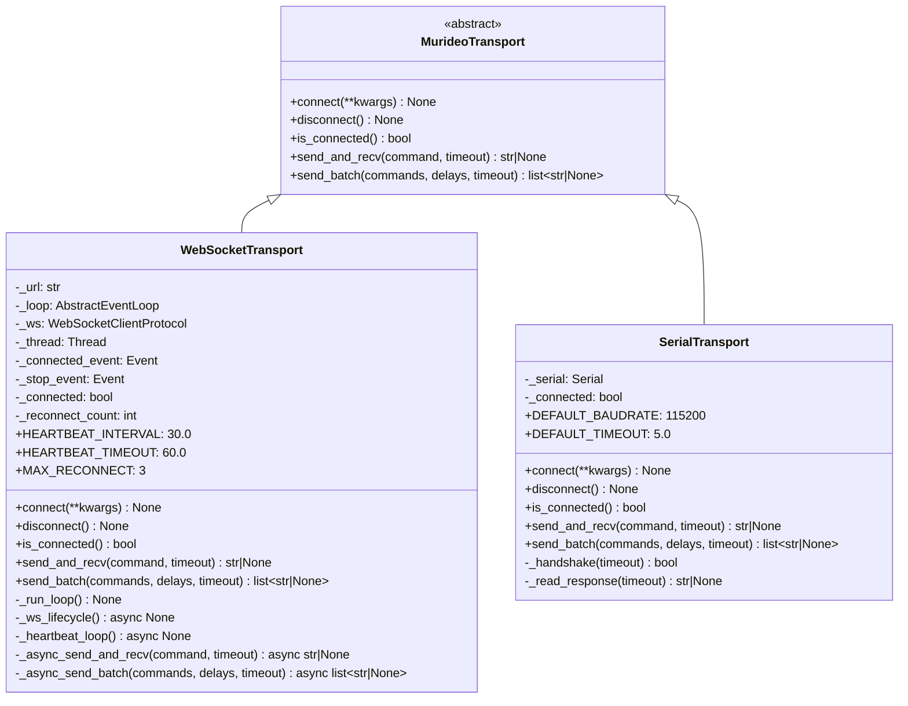
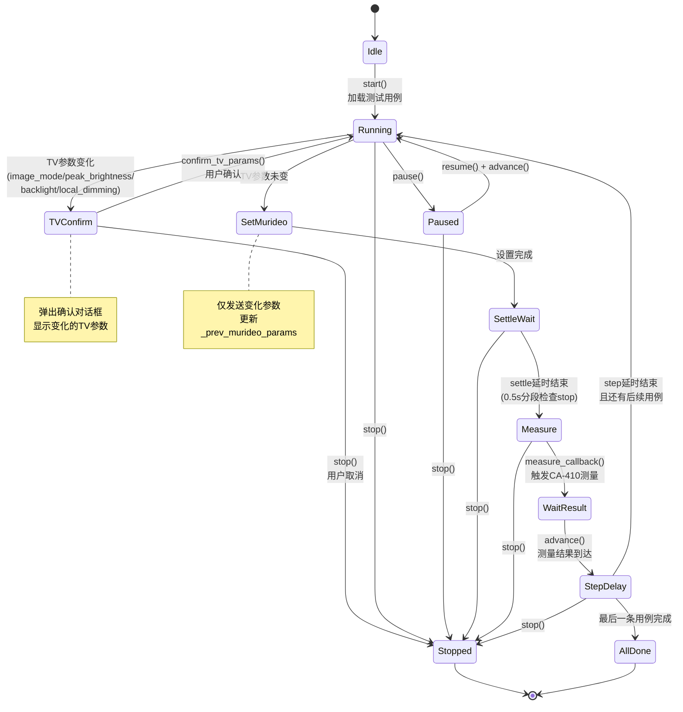
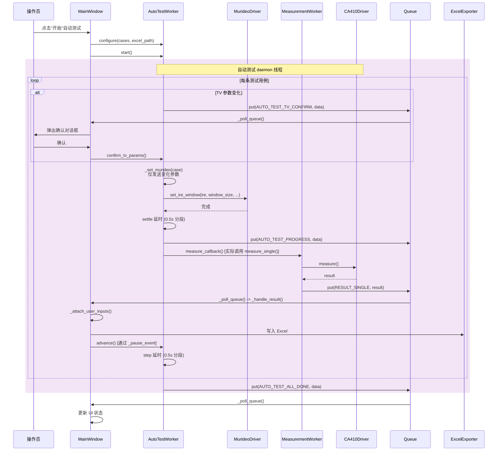
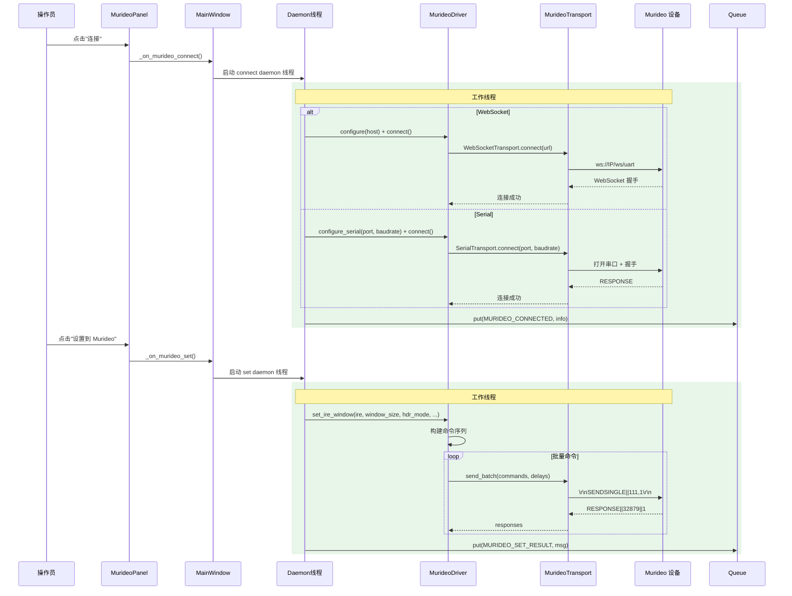
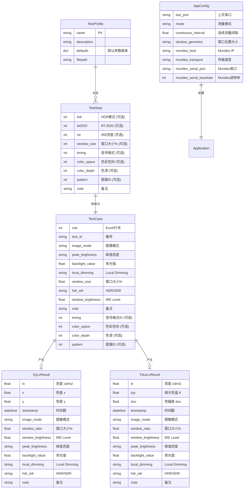

# PqReadTool 概要设计文档 (HLD)

## 文档信息

| 项目 | 内容 |
|------|------|
| 项目名称 | PqReadTool — 显示器画质自动化测试工具 |
| 文档版本 | 1.0 |
| 编写日期 | 2026-05-22 |
| 运行平台 | Windows 桌面应用 (tkinter GUI) |
| Python 版本 | 3.12+ |

---

## 1 系统概述

PqReadTool 是一款面向显示器画质测试的 Windows 桌面自动化工具。系统通过 Konica Minolta CA-410 色彩分析仪采集亮度/色度数据，通过 Murideo Seven G8K 信号发生器控制测试图案输出，实现从信号设置、显示稳定、数据采集到结果写入的全流程自动化。

核心业务场景：

- **手动测量**：操作员手动配置 Murideo 参数和 TV 设置，点击测量按钮获取单次或连续测量结果
- **自动测试**：根据 Excel 测试用例或 JSON 测试方案自动迭代执行，每步自动配置 Murideo、等待显示稳定、触发 CA-410 测量、写入结果
- **峰值亮度测试**：针对 HDR/SDR 不同窗口大小和 IRE 等级的系统化亮度测量

---

## 2 系统架构

### 2.1 分层架构总览

系统采用四层架构，外加横切工具层：



### 2.2 各层职责

| 层级 | 职责 | 关键约束 |
|------|------|----------|
| **UI 层** | 用户交互、数据显示、事件路由 | 仅运行于 tkinter 主线程，禁止阻塞调用 |
| **Worker 层** | 后台任务编排、线程生命周期管理 | 通过 `queue.Queue` 向 UI 层传递结果 |
| **Driver 层** | 硬件协议实现、命令构造与响应解析 | 所有方法为阻塞调用，必须在工作线程执行 |
| **Transport 层** | 底层 I/O 抽象（WebSocket/串口） | 对上层屏蔽连接管理、心跳、重连细节 |
| **Util 层** | 配置管理、数据加载/导出、方案定义 | 无状态或仅持文件 I/O 状态，被 UI 和 Worker 共用 |

### 2.3 架构设计原则

1. **线程隔离**：UI 主线程绝不执行硬件 I/O，所有驱动调用通过 Worker 层在 daemon 线程完成
2. **单向数据流**：Worker -> Queue -> UI，UI 不直接回调 Worker 业务逻辑
3. **传输可替换**：MurideoDriver 通过 MurideoTransport 抽象类支持 WebSocket/Serial 双通道，对上层透明
4. **增量发送**：自动测试时 Murideo 仅发送变化参数，减少通信开销和等待时间
5. **协作取消**：所有长等待循环拆分为 0.5s 片段检查 `stop_event`，确保即时响应停止请求

---

## 3 模块设计

### 3.1 模块清单

| 编号 | 模块名 | 源文件 | 职责 | 外部依赖 |
|------|--------|--------|------|----------|
| M1 | MainWindow | `ui/main_window.py` | 顶层编排器：事件路由、Murideo 操作编排、自动测试编排 | 所有面板、Worker、Util |
| M2 | ConnectionPanel | `ui/connection_panel.py` | CA-410 COM 端口选择与连接状态指示 | `serial.tools.list_ports` |
| M3 | MeasurementPanel | `ui/measurement_panel.py` | 实时测量值显示 (Lv/x/y 或 Lv/Tcp/duv) | 无 |
| M4 | ControlPanel | `ui/control_panel.py` | 测量按钮、TV 参数、测试方案、自动测试控制 | 无 |
| M5 | MurideoPanel | `ui/murideo_panel.py` | Murideo 连接管理、HDR/IRE/窗口/时序/色彩空间/图案控制 | `serial.tools.list_ports` |
| M6 | HistoryPanel | `ui/history_panel.py` | Treeview 表格展示所有测量历史 | 无 |
| M7 | MeasurementWorker | `worker/measurement_worker.py` | CA-410 后台线程管理（连接/测量/校准/连续测量） | CA410Driver |
| M8 | AutoTestWorker | `worker/auto_test_worker.py` | 自动化测试序列器（Murideo 设置 -> 稳定 -> 测量 -> Excel） | MurideoDriver, Util |
| M9 | CA410Driver | `driver/ca410_driver.py` | CA-410 串口驱动 (CA-S40 协议) | pyserial |
| M10 | MurideoDriver | `driver/murideo_driver.py` | Murideo 高层驱动 (命令构造/响应解析/IRE窗口控制) | MurideoTransport |

### 3.2 模块依赖关系图



### 3.3 核心模块详细设计

#### 3.3.1 MainWindow (M1)

MainWindow 是整个应用的顶层编排器，持有以下关键对象：

- `MeasurementWorker`：CA-410 测量工作器
- `MurideoDriver`：Murideo 设备驱动实例
- `AutoTestWorker`：自动测试工作器
- `AppConfig`：用户配置
- 五个 UI 面板实例
- 共享 `queue.Queue`：所有 Worker 的结果都汇入此队列

核心职责：

1. **队列轮询**：通过 `tkinter.after(100ms)` 定时调用 `_poll_queue()`，从队列取出消息并路由到 `_handle_result()`
2. **用户输入附加**：测量结果到达后调用 `_attach_user_inputs()`，将当前面板上的 TV 参数、窗口设置等元数据附着到结果对象
3. **Murideo 操作编排**：连接/设置操作在 daemon 线程中执行，结果通过队列返回主线程
4. **自动测试编排**：将 AutoTestWorker 的 `measure_callback` 绑定到 `worker.measure_single()`，实现工作器间的协作

#### 3.3.2 MeasurementWorker (M7)

管理 CA-410 的所有异步操作，每个操作启动独立的 daemon 线程：

| 方法 | 线程类型 | 功能 |
|------|----------|------|
| `connect(port)` | 临时 daemon 线程 | 打开串口、进入远程模式、探头选择、设置模式、零点校准 |
| `measure_single(mode)` | 临时 daemon 线程 | 单次测量并返回结果 |
| `start_continuous(interval, mode)` | 持久 daemon 线程 | 循环测量，通过 `stop_event.wait(timeout=interval)` 控制间隔 |
| `stop_continuous()` | 主线程 | 设置 `stop_event`，join 连续测量线程 |
| `zero_calibrate()` | 临时 daemon 线程 | 执行零点校准 |
| `set_mode(mode)` | 临时 daemon 线程 | 切换测量显示模式 |

#### 3.3.3 AutoTestWorker (M8)

自动测试流程控制器，核心数据：

- `_cases: list[TestCase]`：当前测试用例列表
- `_current_index: int`：当前执行索引
- `_prev_murideo_params: dict`：上一步 Murideo 参数快照（用于增量发送）
- `_prev_case: TestCase | None`：上一步测试用例（用于 TV 参数变化检测）
- `_measure_callback`：测量回调，由 MainWindow 绑定为 `worker.measure_single()`

关键优化：`_set_murideo()` 方法仅发送与上一步不同的参数，避免重复设置，缩短每步耗时。

#### 3.3.4 CA410Driver (M9)

CA-410 CA-S40 串口协议驱动，关键设计：

- **连接序列**：`COM,1` -> `PSC,1` (可选) -> `MDS,0` -> `ZRC` (自动校准)
- **色度值解析**：CA-410 对 x/y 值省略 "0." 前缀（如 "230" 表示 0.230），`_parse_chromaticity()` 自动处理
- **ER10 自动重试**：`measure()` 中若 MES 返回 ER10，自动执行 ZRC 后重试测量
- **探头选择容错**：单探头型号不支持 PSC 命令返回 ER10，连接时静默跳过

#### 3.3.5 MurideoDriver (M10)

Murideo Seven G8K 高层驱动，关键设计：

- **双传输支持**：通过 `MurideoTransport` 抽象支持 WebSocket 和 Serial
- **IRE 窗口设置**：`set_ire_window()` 在单次连接中完成所有参数设置，因为 IRE 模式状态不跨连接保持
- **命令序列**：可选 timing -> 可选 color_space -> 可选 HDR -> 可选 BT2020 -> 可选 color_depth -> IRE 初始化 -> Window 图案 -> 等 700ms -> IRE+窗口大小
- **错误设备检测**：若串口返回 ER 开头的响应（CA-410 协议），抛出 MurideoCommandError 提示用户检查端口
- **响应解析**：响应格式 `RESPONSE||{32768+CAT}||{VAL}`，通过 `_parse_response()` 解析

---

## 4 线程模型

### 4.1 线程架构



### 4.2 线程间通信

所有工作线程通过共享的 `queue.Queue` 向 UI 主线程传递消息。消息格式为 `(msg_type: str, data)` 二元组。

### 4.3 消息类型定义

| 消息类型 | 来源 | data 类型 | 说明 |
|----------|------|-----------|------|
| `RESULT_SINGLE` | MeasurementWorker | XyLvResult / TduvLvResult | 单次测量结果 |
| `RESULT_CONTINUOUS` | MeasurementWorker | XyLvResult / TduvLvResult | 连续测量结果 |
| `RESULT_ERROR` | MeasurementWorker | str | 测量错误信息 |
| `STATUS_CONNECTED` | MeasurementWorker | str (端口号) | CA-410 已连接 |
| `STATUS_DISCONNECTED` | MeasurementWorker | None | CA-410 已断开 |
| `STATUS_CALIBRATING` | MeasurementWorker | None | 正在校准 |
| `STATUS_CALIBRATED` | MeasurementWorker | None | 校准完成 |
| `MURIDEO_CONNECTED` | MainWindow | str (IP 或串口信息) | Murideo 已连接 |
| `MURIDEO_DISCONNECTED` | MainWindow | None | Murideo 已断开 |
| `MURIDEO_SET_RESULT` | MainWindow | str (操作描述) | Murideo 设置结果 |
| `MURIDEO_ERROR` | MainWindow | str | Murideo 错误 |
| `AUTO_TEST_STARTED` | AutoTestWorker | dict `{total, start_index}` | 自动测试开始 |
| `AUTO_TEST_PROGRESS` | AutoTestWorker | dict `{index, total, case}` | 自动测试进度 |
| `AUTO_TEST_ALL_DONE` | AutoTestWorker | dict `{total}` | 自动测试全部完成 |
| `AUTO_TEST_ERROR` | AutoTestWorker | str | 自动测试错误 |
| `AUTO_TEST_STOPPED` | AutoTestWorker | None | 自动测试已停止 |
| `AUTO_TEST_TV_CONFIRM` | AutoTestWorker | dict `{index, case}` | TV 参数变化需确认 |

### 4.4 线程安全保证

| 机制 | 应用场景 |
|------|----------|
| `queue.Queue` | Worker -> UI 的唯一通信通道，线程安全 |
| `threading.Event` | 连续测量的停止信号 (`_stop_event`)、自动测试的暂停/停止信号 |
| `tkinter.after()` | UI 主线程定时轮询队列，避免跨线程直接操作 tkinter 控件 |
| `asyncio.run_coroutine_threadsafe()` | WebSocketTransport 中从调用线程安全提交协程到事件循环线程 |
| daemon 线程 | 所有工作线程标记为 daemon，主线程退出时自动终止 |

---

## 5 Transport 层设计

### 5.1 类图



### 5.2 WebSocketTransport 详细设计

**连接管理**：

- 在 `connect()` 中创建独立 `asyncio.EventLoop` 并启动 daemon 线程运行 `_run_loop()`
- 使用 `websockets.connect()` 的 async context manager 管理连接生命周期
- 通过 `_connected_event` 同步等待连接建立（超时 = timeout + 5s）

**心跳机制**：

- 每 30 秒发送 WebSocket ping，60 秒超时
- 心跳失败则退出 `_heartbeat_loop()`，触发重连

**自动重连**：

- 指数退避策略：1s, 2s, 4s
- 最大重连次数：3 次
- 重连期间 `_connected = False`，对上层调用抛出 `ConnectionError`

**线程安全调用**：

```python
future = asyncio.run_coroutine_threadsafe(
    self._async_send_and_recv(command, timeout), self._loop
)
return future.result(timeout=timeout + 2.0)
```

### 5.3 SerialTransport 详细设计

**串口参数**：

- 默认 115200/8N1，所有参数用户可配置
- 通过 `kwargs` 传入 baudrate、bytesize、parity、stopbits

**握手验证**：

- 连接后发送 `SENDSINGLE||111,0`（设置 HDR=SDR）
- 期望响应包含 `RESPONSE`
- 握手失败仅警告，不阻止连接（波特率可能需要用户调整）

**回声过滤**：

- Murideo 串口会回显发送的命令
- 过滤规则：跳过包含 `||` 但不以 `RESPONSE` 开头的行

**响应读取**：

- 基于 deadline 的读取循环，50ms 轮询间隔
- 当缓冲区无数据且已有数据时终止读取
- 返回最后一个包含 `RESPONSE` 的行

---

## 6 自动测试状态机

### 6.1 状态转换图



### 6.2 TV 参数变化检测

TV 相关字段（需要操作员在电视上手动调整）：

| 字段 | TestCase 属性 | 说明 |
|------|--------------|------|
| 图像模式 | `image_mode` | 标准/影院/电脑/鲜艳 |
| 峰值亮度 | `peak_brightness` | 关/弱/中/强 |
| 背光值 | `backlight_value` | 数值 |
| Local Dimming | `local_dimming` | 关/弱/中/强 |

检测逻辑：当前用例与上一步用例 (`_prev_case`) 的四个 TV 字段中任一不同，即触发 `AUTO_TEST_TV_CONFIRM` 消息。

### 6.3 协作取消机制

所有长时间等待（settle delay、step delay）均拆分为 0.5s 的 sleep 片段：

```python
remaining = self._settle_delay
while remaining > 0:
    if self._stop_event.is_set():
        # 立即退出
        return
    chunk = min(0.5, remaining)
    time.sleep(chunk)
    remaining -= chunk
```

保证 stop() 请求在 0.5s 内被响应。

---

## 7 数据流设计

### 7.1 单次测量数据流

```mermaid
sequenceDiagram
    participant User as 操作员
    participant CP as ControlPanel
    participant MW as MeasurementWorker
    participant CA410 as CA410Driver
    participant Q as Queue
    participant MainW as MainWindow
    participant MeasP as MeasurementPanel
    participant HP as HistoryPanel
    participant EE as ExcelExporter

    User->>CP: 点击"单次测量"
    CP->>MW: measure_single(mode)
    MW->>MW: 启动 daemon 线程

    rect rgb(255, 243, 224)
        Note over MW,CA410: 工作线程
        MW->>CA410: set_mode(mode) [可选]
        CA410-->>MW: OK
        MW->>CA410: measure() -> MES
        CA410-->>MW: OK00,P1 230;182;12.4

        alt MES 返回 ER10
            MW->>CA410: ZRC (自动零点校准)
            CA410-->>MW: OK
            MW->>CA410: MES (重试)
            CA410-->>MW: OK00,P1 230;182;12.4
        end

        MW->>CA410: _parse_measurement()
        CA410-->>MW: XyLvResult(lv=12.4, x=0.230, y=0.182)
        MW->>Q: put(RESULT_SINGLE, result)
    end

    rect rgb(227, 242, 253)
        Note over Q,EE: UI 主线程
        Q->>MainW: _poll_queue() 取出消息
        MainW->>MainW: _attach_user_inputs(result)<br/>附加TV参数/窗口/备注
        MainW->>MeasP: update_values(result)
        MainW->>HP: add_entry(result)

        opt Excel 写入已启用
            MainW->>EE: export_to_excel([record], filepath)
            EE-->>MainW: (matched, unmatched)
        end
    end
```

### 7.2 自动测试数据流



### 7.3 Murideo 操作数据流



---

## 8 外部接口设计

### 8.1 CA-410 串口接口

| 参数 | 值 |
|------|-----|
| 波特率 | 38400 |
| 数据位 | 8 |
| 校验位 | None |
| 停止位 | 1 |
| 流控 | 无 (RTS/CTS=False, DSR/DTR=False) |
| 超时 | 2.0s (读/写) |

**CA-S40 协议命令**：

| 命令 | 格式 | 功能 | 正常响应 |
|------|------|------|----------|
| 进入远程模式 | `COM,1\r` | 切换到远程控制 | `OK00` |
| 退出远程模式 | `COM,0\r` | 返回本地操作 | `OK00` |
| 探头选择 | `PSC,1\r` | 选择探头1 | `OK00` / `ER10` (单探头) |
| 设置显示模式 | `MDS,{n}\r` | 0=xyLv, 2=TduvLv | `OK00` |
| 测量 | `MES\r` | 触发一次测量 | `OK00,P1 val;val;val` |
| 零点校准 | `ZRC\r` | 执行零点校准 | `OK00` |

**错误响应格式**：`ERxx`，其中 xx 为错误码。

### 8.2 Murideo WebSocket 接口

| 参数 | 值 |
|------|-----|
| URL | `ws://{device_ip}/ws/uart` |
| 默认端口 | 80 (标准 HTTP/WS) |
| 心跳间隔 | 30s (ping) |
| 心跳超时 | 60s |
| 最大重连次数 | 3 |

**命令格式**：`\r\n{FUNCTION}||{CATEGORY},{VALUE}\r\n`

三种命令函数：

| 函数 | 用途 | 示例 |
|------|------|------|
| `SENDSINGLE` | 大部分设置 (timing, HDR, color_space 等) | `\r\nSENDSINGLE||111,1\r\n` |
| `SENDDOUBLE` | 图案和音频选择 | `\r\nSENDDOUBLE||98,26\r\n` |
| `SENDOTHER` | 特殊命令 (IRE/窗口, 恢复出厂) | `\r\nSENDOTHER||30971,255,100\r\n` |

**响应格式**：`RESPONSE||{32768+CATEGORY}||{VALUE}\r\n`

常用分类：

| 分类 ID | 名称 | 命令函数 | 说明 |
|---------|------|----------|------|
| 97 | TIMING | SENDSINGLE | 分辨率/刷新率 |
| 98 | PATTERN | SENDDOUBLE | 测试图案选择 |
| 99 | COLOR_SPACE | SENDSINGLE | 色彩空间 |
| 100 | COLOR_DEPTH | SENDSINGLE | 色深 |
| 111 | HDR | SENDSINGLE | 0=SDR, 1=HDR10, 2=HLG |
| 112 | BT2020 | SENDSINGLE | 0=禁用, 1=启用 |
| 30971 | IRE_WINDOW | SENDOTHER | IRE亮度+窗口大小 |
| 63739 | IRE_INIT | SENDOTHER | IRE模式初始化 |

### 8.3 Murideo 串口接口

| 参数 | 值 |
|------|-----|
| 默认波特率 | 115200 |
| 数据位 | 8 (可配置) |
| 校验位 | None (可配置) |
| 停止位 | 1 (可配置) |
| 握手 | `SENDSINGLE||111,0`，期望 `RESPONSE` |

命令格式与 WebSocket 相同，因为 WebSocket 是设备内部 UART 的桥接。

### 8.4 文件接口

| 接口 | 格式 | 路径/来源 | 说明 |
|------|------|-----------|------|
| 测试用例输入 | Excel (.xlsx) | 用户选择 | "测试用例" sheet，12 列 |
| 测试结果输出 | Excel (.xlsx) | 同输入文件 | 匹配行写入 Lv/x/y，未匹配写入"额外数据" sheet |
| 测试方案 | JSON | profiles/*.json | 包含默认参数和步骤列表 |
| CSV 导出 | CSV (UTF-8-BOM) | 用户选择 | 测量数据导出 |
| 应用配置 | JSON | %APPDATA%/ca410_reader/config.json | 用户偏好持久化 |

---

## 9 数据设计

### 9.1 核心实体关系



### 9.2 数据转换流程

```
Excel (.xlsx)                     JSON Profile
    |                                  |
    v                                  v
TestCaseLoader.load_test_cases()  load_profile() + profile_to_test_cases()
    |                                  |
    +----------> list[TestCase] <------+
                     |
                     | AutoTestWorker 迭代
                     v
              Murideo 设置 + CA-410 测量
                     |
                     v
            XyLvResult / TduvLvResult
            (附加 TV 参数 / 窗口参数 / 备注)
                 /          \
                v            v
    MeasurementPanel     HistoryPanel + ExcelExporter
    (实时显示)           (表格展示 + 写回Excel)
```

### 9.3 数据存储策略

| 数据类型 | 生命周期 | 持久化方式 |
|----------|----------|-----------|
| 测量结果 | 会话期间内存持有 | Excel 写入 (按需)、CSV 导出 (手动) |
| 测试用例 | 会话期间内存持有 | 原始 Excel/JSON 文件 |
| 测试方案 | 加载后内存持有 | JSON 文件 (profiles/ 目录) |
| 应用配置 | 启动加载、退出保存 | %APPDATA%/ca410_reader/config.json |
| Murideo 参数快照 | 自动测试期间 | `_prev_murideo_params` 内存变量 |

不使用数据库，所有业务数据在会话期间保持在内存中。

---

## 10 错误处理设计

### 10.1 异常层次结构

```mermaid
graph TD
    CA410E[CA410Error]

    CA410E --> CE[ConnectionError<br/>串口连接失败]
    CA410E --> CmdE[CommandError<br/>ER00 命令错误]
    CA410E --> ORE[OutOfRangeError<br/>ER05 测量超范围]
    CA410E --> UCE[UndefinedCommandError<br/>ER10 未定义命令]
    CA410E --> ACE[UnacceptableCommandError<br/>ER11 命令不可接受]
    CA410E --> IDE[InvalidDataError<br/>ER13 无效数据]
    CA410E --> IPE[InsufficientProbesError<br/>ER17 探头不足]
    CA410E --> NCDE[NoCalibrationDataError<br/>ER19 无校准数据]
    CA410E --> ZCE[ZeroCalibrationError<br/>ER21/ER30 零点校准错误]
    CA410E --> TE[TimeoutError<br/>设备无响应]

    ME[MurideoError]

    ME --> MCE[MurideoConnectionError<br/>连接失败/断开]
    ME --> MTE[MurideoTimeoutError<br/>设备无响应]
    ME --> MCmdE[MurideoCommandError<br/>命令错误/错误设备]

    style CA410E fill:#FFCDD2,stroke:#C62828,color:#000
    style ME fill:#C8E6C9,stroke:#2E7D32,color:#000
```



### 10.2 CA-410 错误码映射

| 错误码 | 异常类 | 中文说明 | 处理策略 |
|--------|--------|----------|----------|
| ER00 | CommandError | 命令错误或通信错误 | 显示错误，提示重新操作 |
| ER02 | CA410Error | 条件不满足强制终止 | 显示错误 |
| ER05 | OutOfRangeError | 测量值超出范围 (0.01-100,000 cd/m2) | 显示错误，提示调整测量条件 |
| ER10 | UndefinedCommandError | 未定义命令 | 连接时 PSC: 静默跳过; 测量时: 自动 ZRC 重试 |
| ER11 | UnacceptableCommandError | 当前状态不可接受 | 显示错误，提示先执行前置操作 |
| ER13 | InvalidDataError | 无效数据或参数 | 显示错误 |
| ER17 | InsufficientProbesError | 探头数量不足 | 显示错误，提示检查探头连接 |
| ER19 | NoCalibrationDataError | 无有效校准数据 | 显示错误，提示执行校准 |
| ER21 | ZeroCalibrationError | 零点校准错误 | 显示错误，提示盖上探头盖 |
| ER30 | ZeroCalibrationError | 零点校准错误 | 同 ER21 |
| ER80 | ConnectionError | USB 通信错误 | 自动断开，提示重新连接 |

### 10.3 Murideo 错误处理

| 场景 | 错误类型 | 处理策略 |
|------|----------|----------|
| WebSocket 连接失败 | MurideoConnectionError | 通过队列通知 UI 显示错误 |
| WebSocket 断开 | MurideoConnectionError | 自动重连 (最多3次，指数退避) |
| 串口返回 ER 响应 | MurideoCommandError | 检测到连接了 CA-410 而非 Murideo，提示用户 |
| 设备无响应 | MurideoTimeoutError | 通过队列通知 UI，提示检查连接和波特率 |
| 串口打开失败 | MurideoConnectionError | 显示错误，提示检查端口占用 |
| 批量命令部分无响应 | MurideoTimeoutError | 警告日志，若全部无响应则抛出异常 |

### 10.4 串口设备误接检测

系统实现了串口设备误接检测机制，防止将 CA-410 连接到 Murideo 端口或反之：

| 检测点 | 方法 | 判断逻辑 |
|--------|------|----------|
| Murideo Serial 连接时 | `connect()` 握手 | 若收到 `ER` 开头响应，判断为 CA-410 |
| Murideo Serial 设置时 | `send_and_recv()` | 响应以 `ER` 开头，抛出 MurideoCommandError |
| Murideo Serial 批量命令 | `send_batch()` | 收集所有 `ER` 开头的响应 |
| MurideoPanel 串口列表 | `_refresh_serial_ports()` | 标注已知 CA-410 设备 `[CA-410]` |

### 10.5 Excel 文件错误处理

| 场景 | 处理策略 |
|------|----------|
| 文件不存在 | 提示用户重新选择 |
| 文件被锁定 (其他程序打开) | 捕获异常，提示关闭文件后重试 |
| 无"测试用例" sheet | openpyxl 抛出 KeyError，捕获后提示 |
| 无匹配行 | 写入"额外数据" sheet，提示未匹配 |

---

## 11 配置管理

### 11.1 AppConfig 配置项

| 配置项 | 类型 | 默认值 | 说明 |
|--------|------|--------|------|
| `last_port` | str / None | None | 上次使用的 CA-410 串口 |
| `mode` | str | 'xyLv' | 测量显示模式 |
| `continuous_interval` | float | 1.0 | 连续测量间隔 (秒) |
| `window_geometry` | str | '900x650' | 窗口位置和大小 |
| `murideo_host` | str | '192.168.1.239' | Murideo IP 地址 |
| `murideo_transport` | str | 'websocket' | Murideo 传输方式 |
| `murideo_serial_port` | str | '' | Murideo 串口 |
| `murideo_serial_baudrate` | int | 115200 | Murideo 波特率 |

### 11.2 存储路径

- Windows: `%APPDATA%/ca410_reader/config.json`
- 其他平台: `~/.ca410_reader/config.json`

### 11.3 生命周期

- 启动时：`AppConfig.load()` 读取 JSON 文件，合并默认值
- 运行时：通过属性读写器访问
- 退出时：`_on_close()` 中调用 `config.save()` 写入文件

---

## 12 关键设计决策

| 编号 | 决策 | 理由 |
|------|------|------|
| D1 | 使用 `queue.Queue` + `tkinter.after()` 轮询而非线程回调 | tkinter 控件非线程安全，所有 UI 更新必须在主线程 |
| D2 | CA410Driver 直接使用 pyserial 而不经过 Transport 抽象 | CA-410 使用自定义 CA-S40 文本协议，与 Murideo 的命令/响应协议完全不同 |
| D3 | MurideoTransport 抽象类支持 WebSocket 和 Serial | 两种传输方式使用相同的命令格式 (WebSocket 是 UART 桥接)，仅 I/O 层不同 |
| D4 | WebSocketTransport 使用独立 asyncio 事件循环 | WebSocket 需要持久连接和心跳，与 pyserial 的同步模型不兼容 |
| D5 | 自动测试的 Murideo 增量发送 | 减少命令数量和等待时间，对 HDR/SDR 切换等耗时操作尤为重要 |
| D6 | 所有工作线程设为 daemon | 确保主窗口关闭时所有后台线程自动终止，避免僵尸线程 |
| D7 | ER10 自动重试机制 | CA-410 在未校准状态下执行 MES 返回 ER10，自动执行 ZRC 后重试提升用户体验 |
| D8 | IRE 窗口命令在同一连接中批量发送 | Murideo IRE 模式状态不跨连接保持，必须单次连接内完成所有设置 |
| D9 | 测试方案 (Profile) 优于 Excel 测试用例 | JSON 方案支持默认参数继承和更灵活的参数组合，Excel 保留兼容 |
| D10 | 串口设备误接检测 | CA-410 和 Murideo 可能共用相同物理接口，防止串口混接导致协议冲突 |
